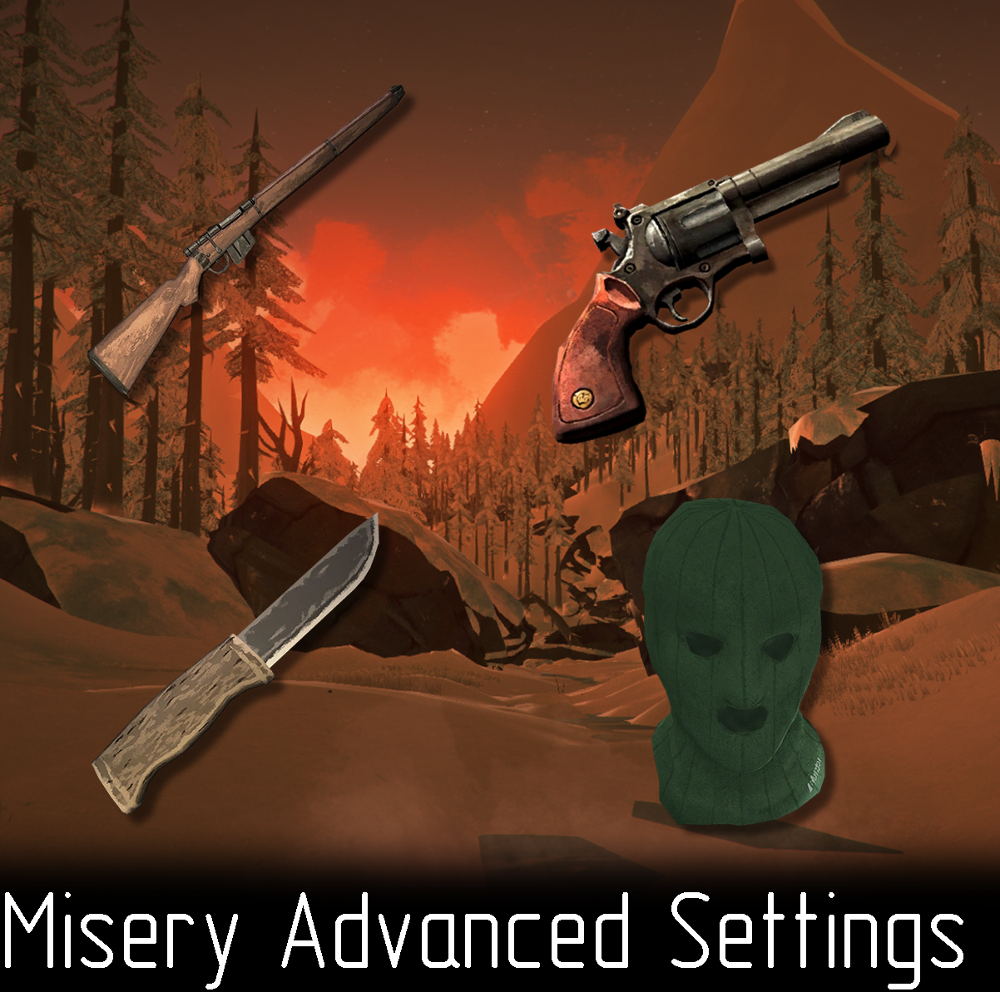

# MiseryAdvancedSettings

Adds more options to customize your misery game mode.

Main features:

- The ability to choose any starting location
- Unlock clothes, tools, food, ammo and some other items that locked in Interloper and Misery modes
- Unlock revolver and rifle. Spawn revolver in 1 spot in each location that can contain it. Also unlocks some rifle spawns

## Installation

You'll need [ModSettings](https://github.com/zeobviouslyfakeacc/ModSettings/releases). Place `MiseryAdvancedSettings.dll` into your `../Mods/` folder.
## Feedback
The mod is still in development and may contain bugs. If something is not working for you or you have suggestions for improvement, you can find me on [The Long Dark Modding](https://discord.gg/QvFE7VV4WZ) Discord server.
 

